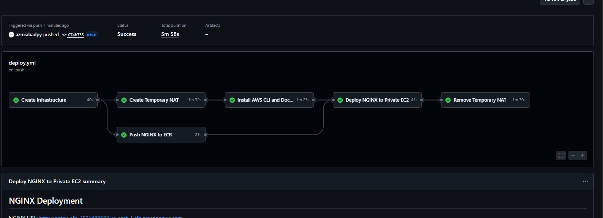
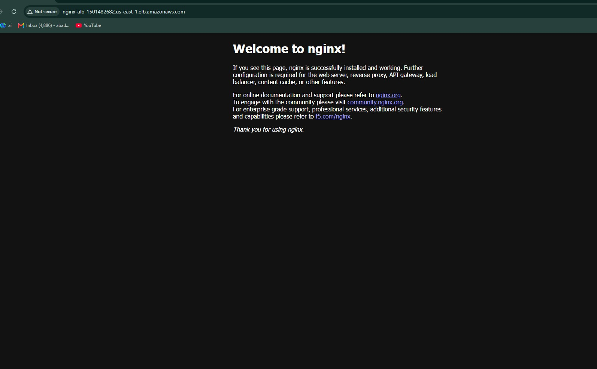

# NGINX Deployment to Private EC2

## Project Overview

This project demonstrates the automated deployment of an NGINX container to a private Amazon EC2 instance using Terraform and GitHub Actions.

The EC2 instance is deployed in a private subnet without a public IP address. GitHub Actions uses AWS Systems Manager (SSM) to manage the private instance.

A temporary NAT Gateway is created during deployment to provide outbound internet access to the private EC2 instance. After the application is deployed and verified, the NAT Gateway and Elastic IP are removed.

The NGINX application is accessed through an Application Load Balancer (ALB).

---

## Architecture

The project uses the following AWS components:

* Amazon VPC
* Public subnet
* Private subnet
* Internet Gateway
* Temporary NAT Gateway
* Private EC2 instance
* Amazon ECR
* IAM roles
* AWS Systems Manager
* Application Load Balancer
* Target Group
* Security Groups

---

## Technologies Used

* AWS
* Terraform
* GitHub Actions
* GitHub OIDC
* Docker
* NGINX
* Amazon ECR
* Amazon EC2
* AWS Systems Manager
* Application Load Balancer

---

## Deployment Flow

```text
GitHub Push
     |
     v
GitHub Actions
     |
     v
Terraform
     |
     v
Create AWS Infrastructure
     |
     +----------------------+
     |                      |
     v                      v
Amazon ECR            Private EC2
                           |
                     Temporary NAT
                           |
                           v
                    Install AWS CLI
                       and Docker
                           |
                           v
                    Pull NGINX Image
                       from ECR
                           |
                           v
                    Run NGINX Container
                           |
                           v
                    Verify NGINX
                           |
                           v
                    Remove NAT Gateway
                           |
                           v
                    Application Load
                       Balancer
                           |
                           v
                    NGINX in Browser
```

---

## GitHub Actions Workflow

The CI/CD workflow is located at:

```text
.github/workflows/deploy.yml
```

The pipeline performs the following operations:

1. Provisions the AWS infrastructure using Terraform.
2. Authenticates GitHub Actions with AWS using OIDC.
3. Pushes the NGINX image to Amazon ECR.
4. Creates a temporary NAT Gateway.
5. Installs AWS CLI and Docker on the private EC2 instance using SSM.
6. Pulls the NGINX image from ECR.
7. Runs the NGINX Docker container.
8. Verifies the NGINX deployment.
9. Retrieves the Application Load Balancer URL.
10. Removes the temporary NAT Gateway and Elastic IP.

### GitHub Actions Pipeline

The following screenshot shows the GitHub Actions deployment pipeline.



---

## GitHub OIDC

GitHub Actions authenticates with AWS using OpenID Connect (OIDC).

No long-term AWS access keys are stored in the GitHub repository.

The workflow assumes the IAM role configured through:

```text
AWS_GITHUB_ROLE_ARN
```

The workflow uses the following permissions:

```yaml
permissions:
  id-token: write
  contents: read
```

This allows GitHub Actions to obtain temporary AWS credentials through the configured OIDC trust relationship.

---

## Amazon ECR

The NGINX container image is pulled from the official NGINX image and pushed to a private Amazon ECR repository.

The image is tagged as:

```text
latest
```

The private EC2 instance then authenticates with Amazon ECR and pulls the image during deployment.

---

## Private EC2 Deployment

The EC2 instance is deployed inside the private subnet and does not require a public IP address.

AWS Systems Manager is used to execute commands on the instance.

The deployment installs:

* AWS CLI
* Docker

The NGINX container is then started on port 80:

```text
docker run -d --name nginx -p 80:80
```

---

## Temporary NAT Gateway

Because the EC2 instance is private, outbound internet access is temporarily required to install the required packages.

The workflow:

1. Allocates an Elastic IP.
2. Creates a NAT Gateway in the public subnet.
3. Adds a temporary default route to the private route table.
4. Installs AWS CLI and Docker.
5. Deploys NGINX.
6. Verifies NGINX.
7. Removes the NAT route.
8. Deletes the NAT Gateway.
9. Releases the Elastic IP.

After deployment is complete, the private EC2 instance returns to private-only networking.

---

## Application Load Balancer

The Application Load Balancer provides public access to the NGINX application without exposing the EC2 instance directly to the internet.

The traffic flow is:

```text
Internet
   |
   v
Application Load Balancer
   |
   v
Target Group
   |
   v
Private EC2
   |
   v
NGINX Container
   |
   v
Port 80
```

The ALB URL is obtained from the Terraform output after deployment.

The URL is displayed in the GitHub Actions workflow summary after the pipeline finishes.

### NGINX Application in Browser

The following screenshot shows the deployed NGINX application accessed through the ALB URL.



---

## Project Result

The project successfully demonstrates automated deployment of a containerized NGINX application to a private EC2 instance.

The final solution provides:

* Private EC2 deployment
* Private Amazon ECR repository
* Dockerized NGINX
* Application Load Balancer for public access
* AWS Systems Manager for private EC2 management
* GitHub Actions CI/CD
* GitHub OIDC authentication
* Terraform infrastructure provisioning
* Temporary NAT Gateway for deployment-time outbound access
* Automatic NAT Gateway cleanup after deployment

The final NGINX application is accessible through the ALB URL generated by Terraform and displayed by the GitHub Actions pipeline.

---

## Repository Structure

```text
casestudyapprunner/
│
├── .github/
│   └── workflows/
│       └── deploy.yml
│
├── terraform/
│   ├── provider.tf
│   ├── variables.tf
│   ├── vpc.tf
│   ├── ec2.tf
│   ├── ecr.tf
│   ├── iam.tf
│   ├── alb.tf
│   └── outputs.tf
│
├── Screenshots/
│   ├── github.jpeg
│   └── browser_test.jpeg
│
├── .gitignore
└── README.md
```
